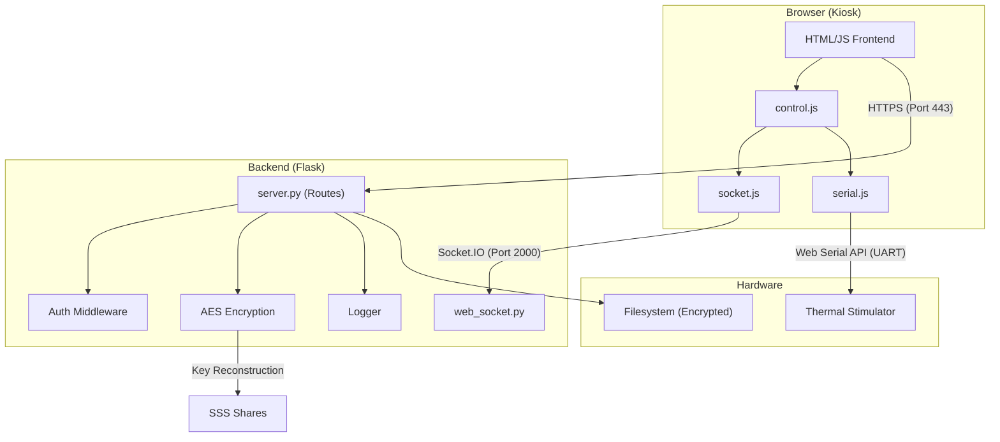
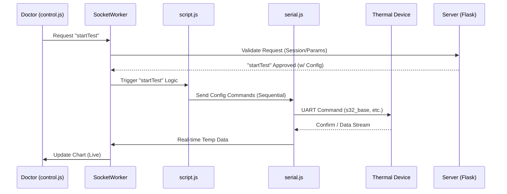

# PainMeterQ (4PMx) Project Analysis

**시스템 분석 및 문서화 리포트**

## 목차
- [1. 요구사항 문서 (SRS)](#1-요구사항-문서-srs---요약)
- [2. 주요 기능 및 검사 항목](#2-주요-기능-및-검사-항목)
- [3. 아키텍처 다이어그램](#3-아키텍처-다이어그램)
- [4. 코드베이스 구조](#4-코드베이스-구조)
- [5. 데이터 흐름도 & 시퀀스 다이어그램](#5-데이터-흐름도--시퀀스-다이어그램)
- [6. 설치 및 배포 환경 정보 & 가이드](#6-설치-및-배포-환경-정보--가이드)

---

## 1. 요구사항 문서 (SRS) - 요약

### 1.1. 개요
본 시스템은 환자의 통증 감각을 정량적으로 측정(QST, VAS, PDS)하고 평가하는 의료 기기 소프트웨어 & 의료기기 입니다.<br/> 
높은 수준의 보안(SSS, AES 암호화)과 안정성으로 환자 데이터의 무결성과 기밀성을 보장하기 위해 보안 기능을 내장하고 있으며, <br/> 
정량감각검사(QST), 시각통증지각검사(VAS), 언어적통증지각검사(PDS) 등 다각적인 통증 측정을 수행하고,<br/> 
그 결과를 안전하게 관리 및 분석하는 로컬 서버(폐쇄망) 애플리케이션입니다.<br/>

### 1.2. 주요 사용자
- **관리자 (Admin)**: 시스템 설정, 백업/복원, 로그 열람, 의사 계정 관리.
- **의사 (Doctor)**: 환자 등록/검색, 검사 수행(QST/VAS/PDS), 결과 분석.
- **환자 (Patient)**: 듀얼 스크린을 통해 문진표 작성 및 검사 지시에 따름.

### 1.3. 보안 요구사항
- **[Cryptography]**: 데이터 및 로그는 AES-256 (CBC)으로 암호화 저장. 키는 SSS(Shamir's Secret Sharing)로 분산 관리.
- **[Integrity]**: 부팅 및 중요 시점마다 소스코드 및 파일 무결성 검증 (HMAC/SHA256).
- **[Access Control]**: 단일 세션 강제 (중복 로그인 차단), 10분 무활동 시 자동 잠금, 비밀번호 복잡도 및 주기적 변경 강제.
- **[Audit]**: 모든 중요 행위(로그인, 검사, 백업 등)는 암호화된 로그로 기록.

------

## 2. 주요 기능 및 검사 항목

본 시스템은 단순한 설문을 넘어 하드웨어 제어를 포함한 복합적인 통증 평가 기능을 제공합니다.

### 2.1. 정량적 감각 검사 (Quantitative Sensory Testing)
의료진이 설정한 프로토콜에 따라 정밀한 열 자극을 가하여 환자의 감각 역치를 측정합니다.
- **QST**:
    - **Base Temp**: 기준 온도 설정 (예: 32°C).
    - **Cool/Warm Threshold**: 냉/온감 감각을 느끼는 역치 측정.
    - **Hot/Cold Pain**: 통증을 느끼는 한계 온도(Goal Temp) 측정.
- **VAS/PDS**:
    - **Cool/Warm**: 냉/온감 감각인 상황에 대한 통증 측정.
    - **TGI (Thermal Grill Illusion)**: Odd/Even 소자에 서로 다른 온도를 인가하여 착각 통증(Illusion) 유발 검사.
- **Protocol Control**:
    - 온도 변화율(Rate), 유지 시간(Duration), 반복 횟수(Trial Count) 정밀 PID 제어.
    - **Fast Mode**: 빠른 선별 검사를 위한 단축 프로토콜 지원.

### 2.2. 통증 평가 설문 (Pain Assessments)
다양한 국제 표준 통증 평가 도구를 디지털화하여 제공합니다.
- **NPS (Neuropathic Pain Scale)**: 신경병증성 통증 척도.
- **PDQ (Pain Detect Questionnaire)**: 통증 탐지 설문.
- **MPQ (McGill Pain Questionnaire)**: 맥길 통증 설문.

### 2.3. 데이터 관리 및 보안
- **환자 관리**: 이름, 생년월일, 주민번호, 성별 등 인적사항 관리 및 검색.
- **이력 조회**: 환자별 검사 이력(CSV) 타임라인 조회 및 결과 리포트 생성.
- **데이터 암호화**: 모든 환자 정보 및 검사 결과는 AES-256 (CBC Mode)로 암호화되어 저장됨.
- **백업/복원**: 시스템 데이터는 자동으로 백업 및 암호화, 바이러스 OR 무결성 검사 이상 발견시 자동 복원 기능.

## 2.4 기능 명세서

| 모듈 | 기능 | 설명 |
| :--- | :--- | :--- |
| **사용자 관리** | 로그인/로그아웃 | ID/PW 인증, 단일 세션 유지, 실패 시 계정 잠금. |
| **사용자 관리** | 계정 관리 | 의사 계정 생성/수정/삭제 (관리자 전용), 비밀번호 변경. |
| **사용자 관리** | 세션 보호 | 일정 시간(10분) 무활동 시 화면 잠금 (Lock Screen). |
| **환자 관리** | 환자 등록 | 이름, 성별, 나이, 주민번호 등록. |
| **환자 관리** | 환자 검색 | 다중 키워드 검색, 최근 검사일 기준 정렬. |
| **환자 관리** | 기록 조회 | 과거 검사 이력(CSV) 리스트 및 선택 조회. |
| **검사 (Test)** | 검사 제어 | 시리얼 통신을 통해 열 자극기 제어 (온도 설정, 시작/중지). |
| **검사 (Test)** | 설문/평가 | QST, VAS, PDS, NPS, PDQ, MPQ 등 다양한 통증 평가 도구 제공. |
| **시스템 관리** | 백업/복원 | 데이터 및 설정을 암호화된 Tarball로 백업 및 복원. |
| **시스템 관리** | 로그 뷰어 | 암호화된 로그 파일을 복호화하여 웹 UI에서 열람. |
| **시스템 관리** | 상태 모니터링 | 저장 공간 부족 경고, USB 무결성 감시, 바이러스 스캔(ClamAV). |

---

## 3. 아키텍처 다이어그램


- **Frontend**: Vanilla JS (ES6+), Web Serial API (Direct Hardware Access).
- **Backend**: Python Flask, Flask-SocketIO (Real-time Sync).
- **Communication**: 
    - **Internal**: Socket.IO (화면 간 동기화).
    - **External**: UART (115200/500000 bps) for Device Control.
    
**기술 스택:** Python (Flask), Javascript (Vanilla), Chromium (Kiosk), JSON/CSV Storage, Web Serial API, Socket.IO  

## 3-1. 보안 아키텍처 (Security)

의료 기기 특성상 강화된 보안 모델을 적용하였습니다.

1.  **Shamir's Secret Sharing (SSS)**:
    - 데이터 암호화에 사용되는 **마스터 키(AES Key)**를 단일 파일로 저장하지 않고, **N개의 조각(Shares)**으로 분할하여 저장.
    - 서버 부팅 시 지정된 개수(K개) 이상의 조각이 있어야만 키를 복구하여 서비스를 시작할 수 있음.
2.  **무결성 검증 (Integrity Check)**:
    - `integrity.py`: 중요 소스코드 및 설정 파일의 **HMAC-SHA256** 해시를 주기적으로 검증.
    - `checksums.json`: 승인된 파일의 해시값 명세서. 변조 감지 시 서버 가동 중단.
3.  **Audit Logging**:
    - 모든 사용자 행위(로그인, 검사 시작, 데이터 조회 등)는 암호화된 로그 파일(`server.log` 등)에 기록.
    - 로그 파일 자체도 암호화되어 있어, 외부 유출 시 내용 확인 불가.
4.  **Session Policy**:
    - **Single Session Enforce**: 동일 ID 중복 로그인 시 기존 세션 강제 종료.
    - **Lock Screen**: 10분간 입력이 없으면 화면 자동 잠금 (재비밀번호 입력 필요).

---

## 4. 코드베이스 구조

```
/root (Project Dir)
├── server.py              # 메인 백엔드 서버 (Flask)
├── web_socket.py          # 실시간 통신 서버 (Socket.IO)
├── run.sh                 # 서버 실행 스크립트 (환경변수 설정, 프로세스 시작)
├── setup.sh               # 초기 설치 및 환경 설정 스크립트
├── logger_config.py       # 로깅 설정 (암호화 로거 포함)
├── integrity.py           # 무결성 검증 모듈
├── sss_manager.py         # SSS 키 관리 및 복구
├── static/                # 프론트엔드 리소스
│   ├── control.js         # 검사 제어 로직 (의사 화면)
│   ├── patient.js         # 환자 관리 로직
│   ├── serial.js          # Web Serial 통신 담당
│   ├── script.js          # 검사 시퀀스 및 커맨드 처리
│   └── ...
├── templates/             # HTML 템플릿 (Jinja2)
├── json/                  # 데이터 저장소 (Config, User, Session 등)
├── logs/                  # 암호화된 시스템 로그
├── security/              # 보안 관련 파일 (SSS Shares 등)
└── certs/                 # SSL 인증서 (자체 인증 기관, 자체 인증서)
```

---

## 5. 데이터 흐름도 & 시퀀스 다이어그램



---

## 6. 설치 및 배포 환경 정보 & 가이드

본 시스템은 Ubuntu/Debian 기반 리눅스 환경(Raspberry Pi OS 권장)에 최적화되어 있습니다.

- **OS**: Linux (Debian/Raspbian based) - `/home/berry` 사용자 환경.
- **Network**: 보안을 위해 Ethernet 및 Wireless 인터페이스 비활성화 (`disable-network.service`).
- **Execution**:
    - `4pmxDevice.service`: 메인 웹 서버 및 로직.
- **Browser**: Chromium (Kiosk Mode, Web Serial 허용, `--password-store=basic`).
- **Port Binding**: `authbind`를 사용하여 일반 권한으로 443(HTTPS) 포트 바인딩.
- **Antivirus**: ClamAV Daemon 상시 실행 및 부팅 시 전체 스캔.

### 6.1. 전제 조건
- **Dependencies**: `python3-venv`, `openssl`, `clamav`, `chromium-browser`, `authbind`.
- **Hardware**: USB Serial 장치 연결 필요.

### 6.2. 설치 스크립트 (`setup.sh`)
```bash
# 1. 저장소 클론 및 디렉토리 이동
git clone [repository_url]
cd 4pmx/ver2

# 2. 설치 스크립트 실행 (일반 사용자로 실행)
./setup.sh
```
* **동작 내용**:
    * Python 가상환경(`venv`) 생성 및 라이브러리 설치.
    * SSL 인증서(Self-signed) 생성 및 시스템 신뢰 저장소(`ca-certificates`) 등록.
    * SSS 초기 키 조각 생성.
    * Systemd 서비스(`4pmxDevice.service`, `usb_monitor.service`) 등록.

### 6.3. 실행 (`run.sh`)
```bash
# 수동 실행
./run.sh

# 서비스 실행 (배포 후)
sudo systemctl start 4pmxDevice.service
```
* 서버 실행 시 자동으로 **바이러스 스캔(ClamAV)** 과 **파일 무결성 검사**를 수행합니다.

---


